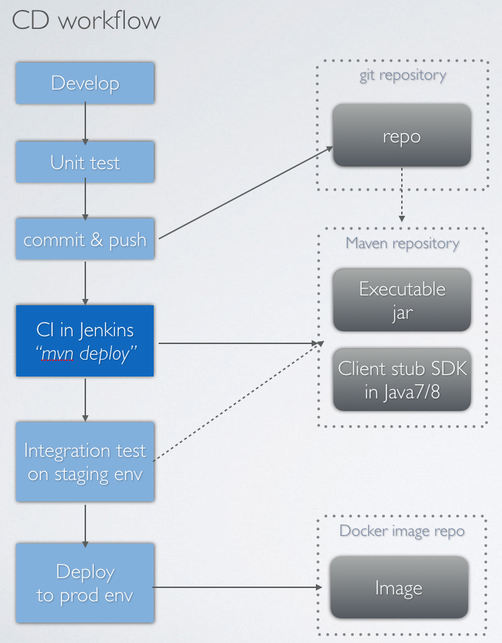

# rest-api-framework
An API framework for building RESTFul Web Services. 

### Overview

- implemented in Java, with available Java version of 8 for server side and 7+ for client side
- supports  [JAX-RS (JSR 311 & JSR 339)](https://jax-rs-spec.java.net/) reference implementation for API 
- choose [Jersey2](https://www.jersey.com/) as web container
- supports [OpenAPI v2.0 Specification](http://swagger.io/specification/) as protocal contract
- supports [JSR 330](https://github.com/google/guice/wiki/JSR330) and user can make [Google Guice](https://github.com/google/guice) as IoC container for better bean management
- leverage [Jetty HTTP Server](http://www.eclipse.org/jetty/) and [OKHttp](http://square.github.io/okhttp/) as p2p network communication framework
- develop server once, got many popular language clients by using [Swagger Codegen](http://swagger.io/swagger-codegen/)
- Automattically full life cycle continuous deployment via [Maven](http://maven.apache.org/) build and [Jenkins](https://jenkins.io/)
- Can integrate with [Grafana](https://grafana.com/) for metric collection

### Architecture

rest-api-framework is a building block which api service and biz module are being able to build upon it, developers just need to focus on how to implement business logic. 

With OpenAPI spec. and RESTful API, multiple language clients are supported.


### Continuous Deployment 

rest-api-framework can be fully integrated with your CD infstructure to facilitate service governance. 



## Table of contents

- [1. Using the Library](#1-using-the-library)
  - [1.1 Develop server-side](#11-develop-server-side)

  - [1.2 Develop client-side[Java or Scala]](#12-develop-client-sidejava-or-scala)

  - [1.3 Develop client-side[Other languages]](#13-develop-client-sideother-languages)

  - [1.4 How to use Guice plugin in server development](#14-how-to-use-guice-plugin-in-server-development)

  - [1.5 Production level server development](#15-production-level-server-development)

    - [1.5.1 Leverage JSON and Java bean](#151-leverage-json-and-java-bean)
    - [1.5.2 Make response with code and errorMsg](#152-make-response-with-code-and-errormsg)
    - [1.5.3 Principles of designing a good RESTful API](#153-principles-of-designing-a-good-restful-api)
    - [1.5.4 Mutil-tiers orgnization](#154-mutil-tiers-orgnization)
    - ​[1.5.5 Logging](#155-logging)
    - [1.5.6 Exception handling](#156-exception-handling)
    - [1.5.7 Versioning](#157-versioning)
    - [1.5.8 Security](#158-security)
    - [1.5.9 Monitoring and Alerting](#159-monitoring-and-alerting)
    - [1.5.10 Useful libraries](#1510-useful-libraries)

  - [1.6 Production level client development](#16-production-level-client-development)

- [2. Countinous Deployment](#2-countinous-deployment)

- [3. Server arguments](#3-server-arguments)

- [Miscellaneous Notes](#miscellaneous-notes)
  - [Development](#development)
  - [Performance test](#performance-test)
  - [Dependencies](#dependencies)
  - [Different from other RPC frameworks](#different-from-other-rpc-frameworks)
  - [Supports Java 8 and Later](#supports-java-8-and-later)


## 1. Using the Library

### 1.1 Develop server-side
#### 1.1.1 Dependency

You can find published releases on Maven.

```
<dependency>
    <groupId>com.neoremind</groupId>
    <artifactId>rest-api-framework</artifactId>
    <version>1.0.0</version>
</dependency>
```

#### 1.1.2 Maven POM configuration

In order to build your server, you can simply checkout the [simple-server#pom.xml](https://github.com/neoremind/rest-api-framework/blob/master/examples/simple-server/pom.xml) for reference and copy to your project.

To make it more clear for you to understand, important maven build steps are clarified:

* compile source code
* assemble to a jar with all dependencies via shade plugin
* generate JavaDoc and source
* use [swagger-maven-plugin](https://github.com/kongchen/swagger-maven-plugin) to generate swagger.json which follows the OpenAPI 2.0 Spec.
* use [swagger-codegen-maven-plugin](https://github.com/swagger-api/swagger-codegen/tree/master/modules/swagger-codegen-maven-plugin) to generate client stub source file
* use maven exec plugin to build client stub to a jar
* if `mvn install` enabled then push the jar to Maven repository.

Please note that the following properties must be set first according to your requirement.

```
<!-- api service default url base path for swagger codegen of client stub -->
<service.test.url>localhost:8080</service.test.url>

<!-- settings needed for swagger codegen of client stub -->
<swagger.ui.title>my-server</swagger.ui.title>
<swagger.ui.version>1.0</swagger.ui.version>
<swagger.ui.description>My simple service</swagger.ui.description>
<swagger.ui.contact.email>xuzh1002@gmail.com</swagger.ui.contact.email>
<swagger.ui.contact.name>Xu Zhang</swagger.ui.contact.name>
<swagger.client.module.package>
com.neoremind.example.simple.server.client
</swagger.client.module.package>

<!-- server launching main class  -->
<main.class.name>com.neoremind.apiframework.JettyServer</main.class.name>
```

#### 1.1.3 Resouce configuration files

Please refer to [the directory](https://github.com/neoremind/rest-api-framework/tree/master/examples/simple-server/src/main/resources) and make some naming adjustment according to your need. You can simply copy-paste and modify.

#### 1.1.4 Develop API

Develop a simple API with JSR-311 Specification annoation, a simple example shows as below. More examples please refer to [simple-server](https://github.com/neoremind/rest-api-framework/tree/master/examples/simple-server) and [production-server](https://github.com/neoremind/rest-api-framework/tree/master/examples/production-server). Please note that parent package of the *Helloworld Class* should be `com.neoremind`.

```
@Path("/helloworld")
@Api(value = "helloworld", description = "hello world")
public class Helloworld {

    private final Logger logger = LoggerFactory.getLogger(this.getClass());

    /**
     * Simply echo message by specifying path query param
     *
     * @param message Path param
     * @return Standard text/plain result
     */
    @GET
    @Path("/1.0/echo/{message}")
    @ApiOperation(value = "echo message", response = Response.class)
    public Response echoBlackholeMessage(
            @ApiParam(value = "message") @DefaultValue("hi") @PathParam("message") String message) {
        logger.info("got " + message);
        return Response.ok(message).type(MediaType.TEXT_PLAIN).build();
    }
}
```

#### 1.1.5 Build

```
mvn clean install
```

#### 1.1.6 Run server

If you use #1.1.5 Build to build a full jar file, simply execute:

```
java -jar your-server.jar
```

If you are developing in IDE, like IntelliJ IDEA or Eclipse, then `Run Configuration -> New Application-> Specify main class to com.neoremind.apiframework.JettyServer -> Launch`

Please note that there are a couple of useful arguments that you can specify to customize your application, please refer to [Server arguments](#Server arguments).

JVM arguments like `-Xms`, `-Xmx` and many others are supported according to the JVM you used.

#### 1.1.7 Visit index page

You can visit the index page on `http://host:port` .


there will be two links, one will show the [swagger.json](http://swagger.io/specification/) while the other redirect you to [swagger-ui](http://swagger.io/swagger-ui/) portal to make quick api calls.


### 1.2 Develop client-side[Java or Scala]

#### 1.2.1 Dependency

You MUST add the client stub dependency through maven or gradle first. 

The client stub jar can be auto-generated and published to Maven repository, for more information about how it works, please go to [Countinous Deployment](). 

The naming convention of the jar is always `${your-server-artifactId}-client`, for example.

```
<dependency>
    <groupId>com.neoremind</groupId>
    <artifactId>your-server-client</artifactId>
    <version>1.0.0-SNAPSHOT</version>
</dependency>
```

There are other dependencies you should configure, please refer to [simple-client#pom.xml](https://github.com/neoremind/rest-api-framework/blob/master/examples/simple-client/pom.xml) for reference.

#### 1.2.2 Make API call

All examples can be checked out in [HelloworldClientTest.java](https://github.com/neoremind/rest-api-framework/blob/master/examples/simple-client/src/test/java/com/neoremind/example/simple/api/client/HelloworldClientTest.java) and [OrderApiClientTest.java](https://github.com/neoremind/rest-api-framework/blob/master/examples/production-client/src/test/java/com/neoremind/example/simple/api/client/OrderApiClientTest.java). For example,

```
HelloworldApi api = new HelloworldApi();
try {
    String response = api.echoMessage("hi");
    System.out.println(response);
} catch (ApiException e) {
    e.printStackTrace();
}
```

Just like the local api call you would make, right? :-) Behind, the client stub does RPC call to remote server. 

HelloworldApi is **thread-safe**, you should make a reference of the instance for multiple calls to optimize performance and avoid some of the overhead.

#### 1.2.3 Client helper utility  

A extention library is provided for you to do some customization work like specify connect/read/write timeout, remote address and retry times, this is **strongly** recommaned to be included into your project. Add the following dependency.

```
<dependency>
    <groupId>com.neoremind</groupId>
    <artifactId>rest-api-client-helper</artifactId>
    <version>1.0.0</version>
</dependency>
```

Sepecify some parameters, please checkout:

```
ApiClient client = new ApiClient()
                .setBasePath("http://localhost:8080")
                .setHttpClient(new OkHttpClientBuilder()
                        .setConnectTimeout(2000)
                        .setReadTimeout(5000)
                        .setWriteTimeout(5000)
                        .setRetryCount(2).build());

        HelloworldApi api = new HelloworldApi(client);
        try {
            String response = api.echoMessage("hi");
            System.out.println(response);
        } catch (ApiException e) {
            e.printStackTrace();
        }
```

### 1.3 Develop client-side[Other languages] 

Please visit [swagger-codegen](http://swagger.io/swagger-codegen/) to download the tool. 

If you have a Mac or a Linux environment, then you could use Homebrew to install the Swagger Codegen.

`brew install swagger-codegen`

For example, you want to get `python` client stub, then execute:

```
swagger-codegen generate -l python -i http://your-server.staging.test.com/swagger.json -o .
```

### 1.4 How to use Guice plugin in server development

Guice (pronounced 'juice') is a lightweight dependency injection framework for Java 6 and above, brought by Google, visit [https://github.com/google/guice](https://github.com/google/guice) for more.

Add the following dependency.

```
<dependency>
    <groupId>com.neoremind</groupId>
    <artifactId>rest-api-guice-plugin</artifactId>
    <version>1.0.0</version>
</dependency>
```

By using [SPI](https://docs.oracle.com/javase/tutorial/sound/SPI-intro.html), create a file under the resource classpath of `META-INF/services/com.neoremind.apiframework.guice.JettyModule` like below which tells where to load your modules.

```
com.neoremind.example.module.MyModule
```

The `Module` class is where you would leverage Guice the manage bean injection. For example, 

```
public class MyModule implements JettyModule {
    @Override
    public void configure(Binder binder) {
        binder.bind(OrderApi.class).in(SINGLETON);
        binder.bind(ProductService.class).to(ProductServiceImpl.class).in(SINGLETON);
    }
}
```

Note that the bean will work fine with Jersey2 web container.  So for example in `OrderApi`, you can inject `ProductService` directly.

```
@Path("/order")
@Api(value = "order", description = "order operation")
@Produces(MediaType.APPLICATION_JSON)
public class OrderApi {

    /**
     * Injected order service bean
     */
    @Inject
    OrderService orderService;

    //.... methods below
}
```

### 1.5 Production level server development

#### 1.5.1 Leverage JSON and Java bean

API's requests and responses can be beans. And the framework will be responsible for ser/deser work. You can define bean as parameter and return type. For example, You can define some beans first.

````
/**
     * Simple request
     */
    static class Request {
        private String name;

        private int id;

        public String getName() {
            return name;
        }

        public void setName(String name) {
            this.name = name;
        }

        public int getId() {
            return id;
        }

        public void setId(int id) {
            this.id = id;
        }
    }

    /**
     * Simple result
     */
    static class Result {
        private String key;
        private int value;

        public Result() {
        }

        public Result(String key, int value) {
            this.key = key;
            this.value = value;
        }

        public String getKey() {
            return key;
        }

        public void setKey(String key) {
            this.key = key;
        }

        public int getValue() {
            return value;
        }

        public void setValue(int value) {
            this.value = value;
        }
    }

    /**
     * Simple result to wrap multiple result
     */
    static class ResultWrapper {
        private List<Result> resultList;

        public List<Result> getResultList() {
            return resultList;
        }

        public void setResultList(List<Result> resultList) {
            this.resultList = resultList;
        }
    }
````

You can return a `Result`.

```
/**
     * Echo number back in JSON format
     *
     * @param number Query param
     * @return Result
     */
    @POST
    @Path("/1.0/echoNumberInJSONFormat")
    @ApiOperation(value = "echo number in JSON format", response = Result.class)
    @Produces(MediaType.APPLICATION_JSON)
    public Result echoNumberInJSONFormat(
            @ApiParam(value = "number") @DefaultValue("100") @QueryParam("number") int number)
            throws HelloworldException {
        logger.info("got " + number);
        if (number == 0) {
            throw new HelloworldException("number is valid with " + number);
        }
        return new Result("number", number);
    }
```

You can use list.

```
/**
     * Accept list request then echo back list response
     *
     * @param requests Request list
     * @return Result list
     */
    @POST
    @Path("/1.0/echoListBack")
    @ApiOperation(value = "echo list back", response = List.class)
    @Produces(MediaType.APPLICATION_JSON)
    public List<Result> echoListBack(
            @ApiParam(value = "request") List<Request> requests) {
        logger.info("got {} requests", requests.size());
        return Lists.transform(requests, r -> new Result(r.getName(), r.getId()));
    }
```

But unfortunately, due to generic type loss in JVM, this is usually not a good pratice. Usually we can wrap generic list in a wrapper.

    /**
     * Accept list request then echo back list response
     *
     * @param requests Request list
     * @return Result list with wrapper
     */
    @POST
    @Path("/1.0/echoListBackWithWrapper")
    @ApiOperation(value = "echo list back", response = ResultWrapper.class)
    @Produces(MediaType.APPLICATION_JSON)
    public ResultWrapper echoListBackWithWrapper(
            @ApiParam(value = "request") List<Request> requests) {
        logger.info("got {} requests", requests.size());
        ResultWrapper wrapper = new ResultWrapper();
        wrapper.setResultList(requests.stream().map(r -> new Result(r.getName(), r.getId())).collect(Collectors.toList()));
        return wrapper;
    }
#### 1.5.2 Make response with code and errorMsg

Make your DTO extends `ResponseWithCodeAndMsg` , and also do error handling like #1.5.6, so client will get error code and message.

```
@ApiModel(value = "pipeline run")
public class PipelineRunDto extends ResponseWithCodeAndMsg {

    @ApiModelProperty(value = "id")
    private Integer id;

    @ApiModelProperty(value = "name")
    private String name;

    //....
}
```

To use `ResponseWithCodeAndMsg` and `OkResponse`, please add the following dependency.

```
<dependency>
    <groupId>com.neoremind</groupId>
    <artifactId>rest-api-commons</artifactId>
    <version>1.0.0</version>
</dependency>
```

#### 1.5.3 Principles of designing a good RESTful API

Read the [link](https://codeplanet.io/principles-good-restful-api-design/).

#### 1.5.4 Mutil-tiers orgnization

Please follow some good examples on [server-exmplae](https://github.com/neoremind/rest-api-framework/tree/master/examples/production-server/src/main/java/com/neoremind/example/production) 
Usually for a request-response model, there are all layered by:

```
  API
   |             DTO(Data Transfer Object)
Facade(optional)
   |     
 Service         VO(Value Object)
   |
  DAO
```

So you can better organize your project struture like below:

```
/api
/dto
/dao
    /impl
/service
        /impl
/module
/vo
/util
/misc
/exception
/common
/resultcode
```

#### 1.5.5 Logging

You can visit `donki->logs` pages to see realtime logs and download history logs. 


#### 1.5.6 Exception handling

Create a `ExceptionMapper` to handle unexpected exception like below. This class extends `AbstractExceptionMapper` which does basic logging to sysout. For the result code please refer [result-util](https://github.com/neoremind/result-util).

```
@Provider
public class RuntimeExceptionMapper extends AbstractExceptionMapper<RuntimeException> implements ExceptionMapper<RuntimeException> {

    @Override
    protected Response doResponse(RuntimeException exception) {
        ResponseWithCodeAndMsg res = new ResponseWithCodeAndMsg();
        res.setCode(GlobalResultCode.INTERNAL_SERVER_ERROR.getCode());
        res.setMsg("something's wrong");
        return Response.status(Response.Status.OK)
                .type(MediaType.APPLICATION_JSON)
                .entity(res)
                .build();
    }
}
```

#### 1.5.7 Versioning

Whenever you make changes to the server API, in order to not affect the client, you should always add a new method and change the request URL path. 

Or you can change `version ` in URL path. For example from `1.0` to `1.1`

```
PUT /deletion_uid/1.0/create/{import_date}/{import_path}
```

#### 1.5.8 Security

Will be enhanced in the future by providing APPID & TOKEN or LDAP authentication.

#### 1.5.9 Monitoring and Alerting

API call logging are pushed into Grafana if you configure it by default. 

#### 1.5.10 Useful libraries 

You can develop granceful and clean code by using the following libraries.

* [fluent-validator](https://github.com/neoremind/fluent-validator)
* [easy-mapper](https://github.com/neoremind/easy-mapper)
* [result-util](https://github.com/neoremind/result-util)

You can check example code in [production-server](https://github.com/neoremind/rest-api-framework/tree/master/examples/production-server/src/main/java/com/neoremind/example/production).

### 1.6 Production level client development

You can simply call throught client stub like below.

```
Snapshot snapshotApi = new SnapshotApi(client);
snapshotApi.call("123");
```

Also you can specify some parameters like connect/read/write timeout, remote address and retry times. Please refer to Section#1.2.3 for more.

```
ApiClient client = new ApiClient()
                .setBasePath("http://localhost:8080")
                .setHttpClient(new OkHttpClientBuilder()
                        .setConnectTimeout(2000)
                        .setReadTimeout(5000)
                        .setWriteTimeout(5000)
                        .setRetryCount(2).build());

        HelloworldApi api = new HelloworldApi(client);
        try {
            String response = api.echoMessage("hi");
            System.out.println(response);
        } catch (ApiException e) {
            e.printStackTrace();
        }
```

Last in production level environment, if you would like to **re-throw or reproduce server side exception**, you can intercept you api with a proxy like below. Not that the exception thrown is based on` msg` in `ResponseWithCodeAndMsg`

```
ProxyCreator proxyCreator = new DefaultProxyCreator();
ApiClient client = new ApiClient()
        .setBasePath(CONFIG.getString("service.base.url"))
        .setHttpClient(new OkHttpClientBuilder()
                .setConnectTimeout(2000)
                .setReadTimeout(5000)
                .setWriteTimeout(5000)
                .setRetryCount(0)
                .build());
SnapshotApi snapshotApi = new SnapshotApi(client);

// handle response status code is not 0(OK), then re-throw exception
snapshotApi = proxyCreator.createInterceptorProxy(snapshotApi, new ApiStatusNotOkThenRethrowExceptionInterceptor(), SnapshotApi.class);
```

If you do not want to re-throw exception, just logging is enough. You can use `ApiStatusNotOkThenLogExceptionInterceptor`.

```
snapshotApi = proxyCreator.createInterceptorProxy(snapshotApi, new ApiStatusNotOkThenLogExceptionInterceptor(), SnapshotApi.class);
```

### 2. Countinous Deployment

By leveraging Jenkins CI tool, the client stub can be auto-published to Maven repository.

### 3. Server arguments

The following arguments are loaded in the below sequence.

1. If exists in shell environment, then return, else go to #2.
2. If exists in -D VM arguments like `java -jar your-server.jar -DPORT=8090` then return, else go to #3.
3. If exists in `conf/api-server.conf`, then try load, else use default.

| Argument                        |                   Desc                   | Default value |
| ------------------------------- | :--------------------------------------: | ------------: |
| PORT                            |               server port                |          8080 |
| JETTY_QUEUE_MAX_CAPACITY        |   jetty http server request queue size   |         65536 |
| JETTY_MIN_THREADS               |       http server thread min size        |           100 |
| JETTY_MAX_THREADS               |       http server thread max size        |           400 |
| JETTY_THREAD_IDLE_TIMEOUT_IN_MS | http server thread max idle time,if exceeds then destroy the thread |        120000 |

### Miscellaneous Notes

#### Different from other RPC frameworks

There are a lot of RPC frameworks out there, for examples Finagle, gRPC, thrift, dubbo, akka, avro. In general like the other frameworks, ap-api-framework is just one of the building block for implementing a RPC service. All RPC framework will be talking about topic likes

* I/O model (epoll, aio, sync/async, blocking/non-blocking, reactor, etc)
* binary data and type handling (big-endian, your own protocol of processing binary stream, etc)
* serialization & deserialzation (protobuf, json, etc)
* transport protocol (TCP/UDP for all, HTTP/SOAP for application layer, etc)
* compression (no-compress, gzip, snappy, etc)
* keep-alive or short-live connection model 
* client stub or sdk generation and support multiple languages

The list will go on and on. rest-api-framework has the basic capability of all of the above. What's more it has fully integrated into your's ecosystem to provide a more **governanced** building block. It has

* auto generated client stub and publish to maven repository
* decent performance
* integrate Google Guice of IoC container

If you are interested, there are actually 2 more frameworks owned by me, you can checkout them on github: [navi](https://github.com/neoremind/navi) [navi-pbrpc](https://github.com/neoremind/navi-pbrpc).
