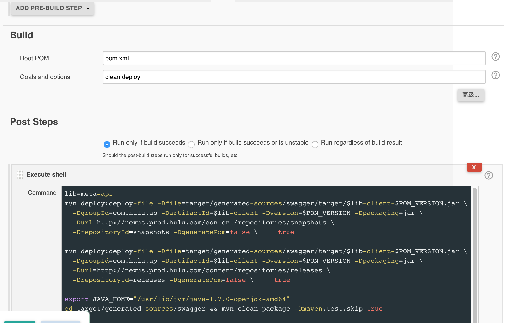

## Steps of publishing client stub to maven repository

After `mvn clean deploy` command to build. You should add a post steps in jenkins like below. This will help you to send snapshots and releases to repository. 

Please note that you ONLY need to change `lib` to your project artifact id. Keep the other command unchanged.

```
lib=meta-api
mvn deploy:deploy-file -Dfile=target/generated-sources/swagger/target/$lib-client-$POM_VERSION.jar \
  -DgroupId=com.hulu.ap -DartifactId=$lib-client -Dversion=$POM_VERSION -Dpackaging=jar \
  -Durl=http://nexus.prod.hulu.com/content/repositories/snapshots \
  -DrepositoryId=snapshots -DgeneratePom=false \  || true
  
mvn deploy:deploy-file -Dfile=target/generated-sources/swagger/target/$lib-client-$POM_VERSION.jar \
  -DgroupId=com.hulu.ap -DartifactId=$lib-client -Dversion=$POM_VERSION -Dpackaging=jar \
  -Durl=http://nexus.prod.hulu.com/content/repositories/releases \
  -DrepositoryId=releases -DgeneratePom=false \  || true
  
export JAVA_HOME="/usr/lib/jvm/java-1.7.0-openjdk-amd64"
cd target/generated-sources/swagger && mvn clean package -Dmaven.test.skip=true

cd -
mvn deploy:deploy-file -Dfile=target/generated-sources/swagger/target/$lib-client-$POM_VERSION.jar \
  -DgroupId=com.hulu.ap -DartifactId=$lib-client-java7 -Dversion=$POM_VERSION -Dpackaging=jar \
  -Durl=http://nexus.prod.hulu.com/content/repositories/snapshots \
  -DrepositoryId=snapshots -DgeneratePom=false \  || true
  
mvn deploy:deploy-file -Dfile=target/generated-sources/swagger/target/$lib-client-$POM_VERSION.jar \
  -DgroupId=com.hulu.ap -DartifactId=$lib-client-java7 -Dversion=$POM_VERSION -Dpackaging=jar \
  -Durl=http://nexus.prod.hulu.com/content/repositories/releases \
  -DrepositoryId=releases -DgeneratePom=false \  || true
```

